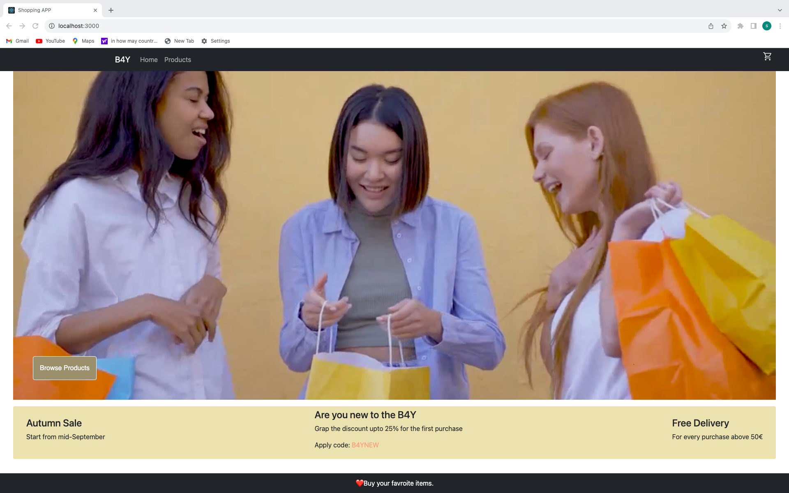
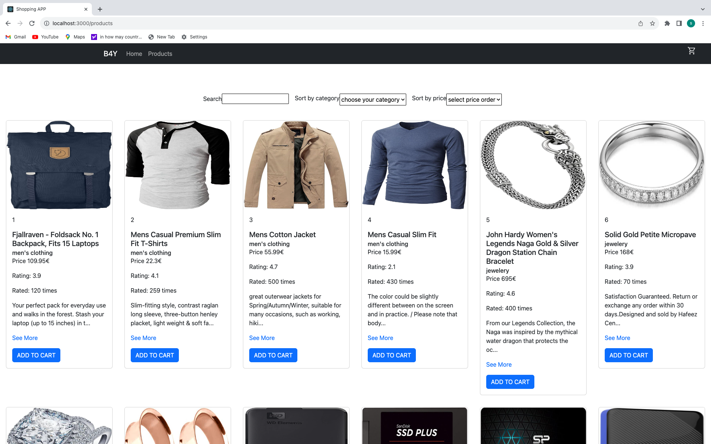

# Shopping app

## stack
- React, Bootstrap

## Use in your local machine
```
git clone https://github.com/SantoshChapagai/shopping-app.git
npm install
npm start
```

### screen-shot



### About
- Application that fetch the data from Fake Store API
```
  https://fakestoreapi.com/products/

```
- All the information related to the products are fetch and arranged in the card with the Bootstrap card component.
- Add to cart button adds count to the cart component of header(No more functionality just add number of time add to cart button clicked)

### Homepage
- Homepage with header at the top which includes navigating tags.
- video that plays continiously (CC0 video).
- section that provides basic information about the discount code.
- Footer at the end of the page

### Products
- Page that contains all the products fetch from API.
- search component that allows user to search product by name.
- sort by category allows user to filter the products based on category.
- sort by price allows user to arrange product based on price either from low to high price or high to low price.
